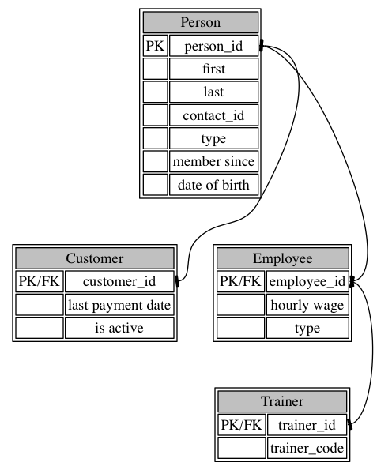

1. Introduction
===============

The problem domain we seek to solve is organizing our knowledge of our gym business into a clear, concise data model.
THe key being to represent the core parts of our business, to enhance the experience of out customer and to get insights into what we, the gym, need to do to make it better.

To start off, I will layout the key entities below, which most of our data model will center around.

2. Key Entities
===============

There are two major entities in our model, "People" and "Equipment."
From these, most of our data model is derived.

2.1. People
-----------

As a gym we "have" many people.
People can be many things, employees, customers and personal trainers.
Below is a simple table outlining all the properties these people have in common.

----------- ----------- ---------- -----------------------------------
column name type        typeof key description
----------- ----------- ---------- -----------------------------------
person_id   VARCHAR(6)  primary    The primary identifier of a person.

fisrt       VARCHAR(30) n/a        The person's first name, UTF8.

last        VARCHAR(30) n/a        The person's last name, UTF8.

contact_id  VARCHAR(6)  foriegn    A contact id linking to an entity's
                                   Contact info.

type        VARCHAR(1)  n/a        A char that determines if the user
                                   is an employee or customer.

since       DATE        n/a        A date describing when they were a
                                   member of the gym. 

birth       DATE        n/a        DOB of a user can provide which
                                   can be used to offer specials.
----------- ----------- ---------- -----------------------------------

: A Person entity

### 2.1.1. Customer

A customer entity is a person who ends up using our services and pays us.
Below is the definition of a customer.

----------- ----------- ---------- -----------------------------------
column name type        typeof key description
----------- ----------- ---------- -----------------------------------
person_id   VARCHAR(6)  PK/FK      The primary identifier of a
                                   customer, from person.

last_pay    DATE        n/a        Indicates if this customer is up to
                                   date with their membership fees.

is_active   BOOLEAN     n/a        Programmatically indicates if 
                                   customer is up to date with payment
                                   Determined by since field in parent
                                   and last_pay date
----------- ----------- ---------- -----------------------------------

: A customer entity

### 2.1.2. Employee

An employee entity is someone we pay to maintain and provid services to the customers through the gym.
Below is the entity.

----------- ----------- ---------- -----------------------------------
column name type        typeof key description
----------- ----------- ---------- -----------------------------------
person_id   VARCHAR(6)  PK/FK      The primary identifier of a
                                   customer, from person.

wage        NUMBER      n/a        amount paid per hour.

type        CHAR(1)     n/a        Determines if the user is a
                                   generic employee or a physical 
                                   therapist or trainer.
----------- ----------- ---------- -----------------------------------

: A employee entity

### 2.1.3. Trainer

A trainer is an employee that is responsible for running classes at the gym or offering one on one consulting for customers.

----------- ----------- ---------- -----------------------------------
column name type        typeof key description
----------- ----------- ---------- -----------------------------------
person_id   VARCHAR(6)  PK/FK      The primary identifier of a

code        VARCHAR(6)  n/a        an extra random code that is passed
                                   to other entities to ensure only
                                   trainers are entered.
----------- ----------- ---------- -----------------------------------

: A Trainer entity

2.2. Equipment
--------------

A gym has numerous amounts of workout related equipment.
Below is an entity used to identify this equipment at a high level.

----------- ----------- ---------- -----------------------------------
column name type        typeof key description
----------- ----------- ---------- -----------------------------------
equip_id    VARCHAR(6)  primary    The primary identifier of the gear.

name        VARCHAR(30) n/a        name of the gear.

brand       VARCHAR(30) n/a        brand name of the gear.

type        CHAR(1)     n/a        A char that determines if the 
                                   equipment is a machine of if it is
                                   A free weight or a weightlifting
                                   component

since       DATE        n/a        A date describing when the gear
                                   was added to the gym.

birth       DATE        n/a        DOB of a user can provide which
                                   can be used to offer specials.
----------- ----------- ---------- -----------------------------------

: The high level equipment gear.

